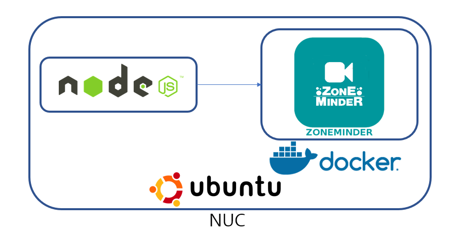

# Zoneminder

## To use docker hub :
### Docker Container Set up Zoneminder 1.32.2
<code>docker pull dlandon/zoneminder</code>

### Docker Container Set up Zoneminder 1.30.4
<code>git clone https://github.com/DNSlabCCTV/Zoneminder</code> 
<code>cd Zoneminder</code> 
<code>unzip zoneminder-51fa254a84eec93d408d4f5070eb67edc39100c3.zip</code> 
<code>cd zoneminder-51fa254a84eec93d408d4f5070eb67edc39100c3</code> 
<code>docker build -t zoneminder . </code> 
<code>docker run -d -p 8080:80 zoneminder</code> 

### Docker run command
<code>docker run -d --name="Zoneminder" \ </code> 
<code>--net="bridge" \ </code> 
<code>--privileged="true" \ </code> 
<code>-p 8080:80/tcp \ </code> 
<code>-e TZ="America/New_York" \ </code> 
<code>-e SHMEM="50%" \ </code> 
<code>-e PUID="99" \ </code> 
<code>-e PGID="100" \ </code> 
<code>-v "/mnt/cache/appdata/Zoneminder":"/config":rw \ </code> 
<code>-v "/mnt/cache/appdata/Zoneminder/data":"/var/cache/zoneminder":rw \ </code> 
<code>dlandon/zoneminder</code> 

To access the Zoneminder gui: http://IP:8080/zm

## Test API
 
##### ■ Add Cameras in Node.JS
Use Zoneminder.ZoneminderSetup Function

##### ■ Delete Cameras in Node.JS
Use Zoneminder.ZoneminderDeleteMonitor Function

## link
https://hub.docker.com/r/dlandon/zoneminder/
